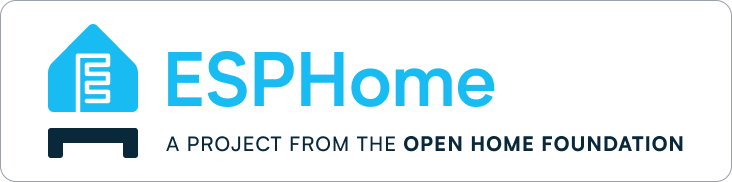
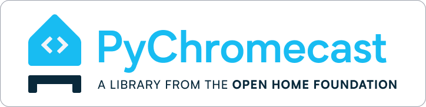

# Open Home Foundation website

This is the source of the Open Home Foundation website.

## Deployment

This website is automatically deployed with Cloudflare pages on each commit to the main branch.

## Badges
This repository also contains the badges for various projects and partners to use with permission. Below are examples of how these are to be used in a repo.
### Home Assistant
[](https://www.openhomefoundation.org/)
```markdown
[](https://www.openhomefoundation.org/)
```
### ESPHome
[](https://www.openhomefoundation.org/)
```markdown
[](https://www.openhomefoundation.org/)
```
### PyChromecast
[](https://www.openhomefoundation.org/)
```markdown
[](https://www.openhomefoundation.org/)
```
### Python Matter Server
[](https://www.openhomefoundation.org/)
```markdown
[](https://www.openhomefoundation.org/)
```
### Pytradfri
[](https://www.openhomefoundation.org/)
```markdown
[](https://www.openhomefoundation.org/)
```
### Zigpy
[](https://www.openhomefoundation.org/)
```markdown
[](https://www.openhomefoundation.org/)
```
### OHF Collaborator
[](https://www.openhomefoundation.org/)
```markdown
[](https://www.openhomefoundation.org/)
```
### OHF Library
[](https://www.openhomefoundation.org/)
```markdown
[](https://www.openhomefoundation.org/)
```
### OHF Open Standard
[](https://www.openhomefoundation.org/)
```markdown
[](https://www.openhomefoundation.org/)
```
### OHF Project
[](https://www.openhomefoundation.org/)
```markdown
[](https://www.openhomefoundation.org/)
```